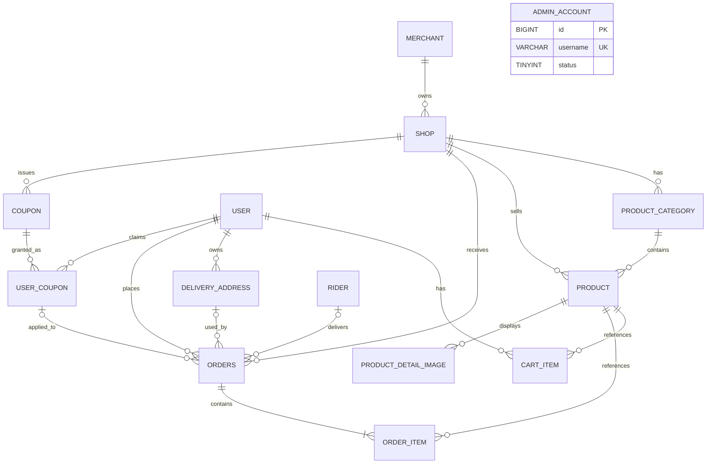

# 数据库 ER 图

## 1. 设计说明

本数据库设计以 2026 年软件工程综合实践任务书为主要依据，旧版饿了么项目任务书仅作为业务流程和表结构参考，不直接照搬。

数据库对应 V1—V7 迁移，共 14 张表：

- 用户（USER）
- 商家（MERCHANT）
- 店铺（SHOP）
- 商品分类（PRODUCT_CATEGORY）
- 商品（PRODUCT）
- 购物车明细（CART_ITEM）
- 收货地址（DELIVERY_ADDRESS）
- 订单（ORDERS）
- 订单明细（ORDER_ITEM）
- 商品详情图（PRODUCT_DETAIL_IMAGE）、店铺券（COUPON）、用户券（USER_COUPON）
- 骑手（RIDER）、管理员（ADMIN_ACCOUNT，独立账号表）

## 2. 实体关系图

## 3. 主要关系说明

1. 一个商家可以拥有多个店铺，一个店铺只属于一个商家。
2. 一个店铺可以拥有多个商品分类，一个商品分类只属于一个店铺。
3. 一个店铺可以销售多个商品，一个商品只属于一个店铺。
4. 一个商品分类可以包含多个商品，一个商品只属于一个商品分类。
5. 一个用户可以拥有多条购物车明细，每条购物车明细只属于一个用户。
6. 一个商品可以出现在多条购物车明细中，每条购物车明细只对应一个商品。
7. 一个用户可以维护多个收货地址，每个收货地址只属于一个用户。
8. 一个用户可以创建多个订单，每个订单只属于一个用户。
9. 一个店铺可以接收多个订单，每个订单只属于一个店铺。
10. 一个收货地址可以被多个订单使用；订单的地址关联可空，地址删除后清空关联，订单保留收货信息快照。
11. 一个订单至少包含一条订单明细，每条订单明细只属于一个订单。
12. 一个商品可以出现在多条订单明细中，每条订单明细对应一个商品。
13. 商品详情图按排序展示，接口最多 3 张；删除商品时级联删除详情图。
14. 店铺发行多种券，用户每种券只领取一次。用户券与历史订单不是一对一：取消返券后可以再次下单，旧订单保留关联，重复取消旧订单不得返还新订单占用的券。
15. 订单最多关联一个用户券和一个骑手，均可空。接单原子绑定骑手；接单不改变制作中状态。
16. 管理员使用独立账号表，没有业务外键，不开放自助注册。

## 4. 设计约束

1. 商品必须同时关联店铺和商品分类。
2. 商品所属分类必须属于商品对应的店铺。
3. 购物车中同一用户与同一商品只能存在一条记录，通过修改数量完成增减操作。
4. 购物车商品数量必须大于零。
5. 商品接口价格必须大于零，商品库存不能小于零。
6. 一个订单只能包含同一家店铺的商品。
7. 一个订单至少包含一条订单明细。
8. 订单明细需要保存商品名称和成交单价快照，避免商品信息变化影响历史订单。
9. 订单需要保存收货人、联系电话和详细地址快照，避免用户修改或删除地址后影响历史订单。
10. 店铺营业状态需要支持营业、休息和临时闭店。
11. 密码字段只保存加密后的密码，不保存明文密码。
12. 数据库结构变更必须通过版本化 SQL 完成，不能只手工修改本地数据库。

## 5. 状态字段

### 店铺状态

| 状态值 | 含义 |
| --- | --- |
| 0 | 休息 |
| 1 | 营业 |
| 2 | 临时闭店 |

### 商品状态

| 状态值 | 含义 |
| --- | --- |
| 0 | 下架 |
| 1 | 上架 |

### 订单状态

| 状态值 | 含义 |
| --- | --- |
| 0 | 待处理 |
| 1 | 已确认 |
| 2 | 制作中 |
| 3 | 配送中 |
| 4 | 已完成 |
| 5 | 已取消 |

## 6. 补充约束

1. 商家与店铺采用一对多关系，一个商家可以拥有多个店铺。
2. 一个用户的购物车只允许同一家店铺的商品；下单只清理所选购物车项。
3. 订单保存收货人、联系电话和详细地址快照。
4. 订单明细保存商品名称和成交单价快照。
5. 店铺状态分为休息、营业和临时闭店。
6. 商品状态分为下架和上架。
7. 用户和商家通过状态字段进行启用或禁用。
8. 历史订单关联的数据不进行物理删除，收货地址是已确认的例外：允许删除，沿用 `ON DELETE SET NULL` 清空订单地址关联，订单快照不变。
9. 数据库主键统一使用 BIGINT 自增整数。
10. 表名和字段名统一采用小写 snake_case 命名。
11. 订单总金额 = 商品金额 − 实际优惠 + 配送费；优惠不抵配送费。下单核销、扣库存、保存订单和清购物车同事务，首次取消恢复库存并返券。
12. `user_coupon.status` 只保存 0 未使用 / 1 已使用；过期、停用和是否达到门槛由券模板及当前时间计算，不另存展示状态。删除用户券时订单关联置空，优惠金额快照不变；当前没有删除用户券的公开接口。
