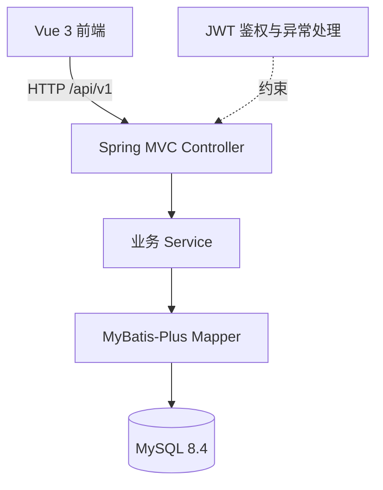
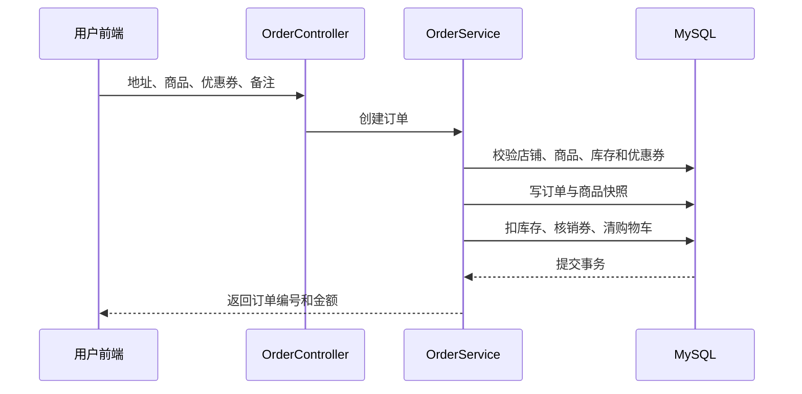
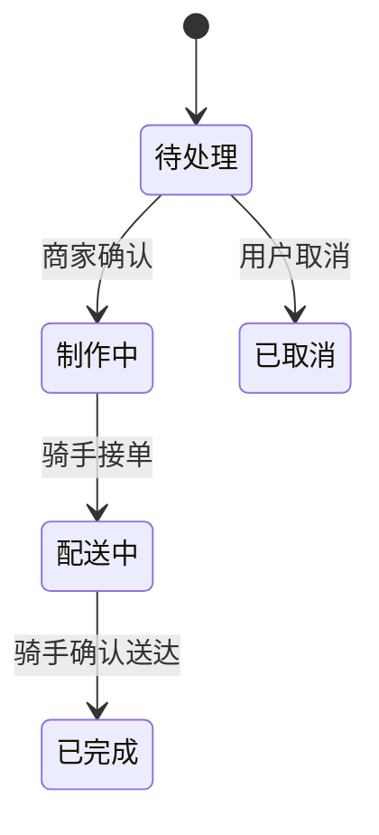

# 项目设计文档

## 1. 文档目的

本文档基于当前 `main` 分支的代码、配置和数据库迁移，集中说明系统架构、模块划分、数据关系、鉴权边界及关键业务事务。功能范围以[需求文档](requirements.md)为准，字段和接口细节以[接口契约](../api-contract.md)为准，数据库结构以[ER 图](database/er-diagram.md)和[数据字典](database/data-dictionary.md)为准。

## 2. 设计目标与约束

- 支持用户、商家、骑手和管理员四种身份，身份数据及权限相互隔离。
- 采用前后端分离和 REST 风格接口，统一使用 `/api/v1` 前缀。
- 关键业务规则在后端校验，前端校验仅用于改善交互。
- 下单、扣减库存、核销优惠券、清理购物车等操作保持事务一致性。
- 取消订单能够恢复库存和优惠券，重复操作不得造成重复恢复。
- 使用版本化 SQL 迁移维护数据库，已应用的迁移不回改。
- 本项目展示支付信息，不接入真实支付渠道。

## 3. 总体架构



前端负责页面展示、路由、表单交互和请求状态管理；后端负责身份校验、资源归属、业务状态转换、金额计算和事务；MySQL 持久化业务数据。开发环境由 Vite 将 `/api` 请求代理到 Spring Boot，构建产物部署时由外部 Web 服务器承担静态资源、SPA 回退和反向代理，具体见[部署与运行指南](deployment.md)。

## 4. 技术选型

| 层次 | 技术 | 作用 |
| --- | --- | --- |
| 前端 | Vue 3、Vue Router、Axios、Element Plus | 页面、路由、请求和组件交互 |
| 前端构建 | Vite 8.2.2 | 开发服务器与生产构建 |
| 后端 | JDK 21、Spring Boot 3.5.16 | REST 服务、配置和依赖管理 |
| 安全 | Spring Security、JWT | 登录令牌、身份识别和接口授权 |
| 数据访问 | MyBatis-Plus 3.5.17 | Mapper、查询和持久化 |
| 数据库 | MySQL 8.4 | 业务数据和事务 |
| 测试 | JUnit 5、MockMvc、H2、Node Test、JaCoCo | 单元、接口、兼容性和覆盖率验证 |

## 5. 后端分层

后端根包为 `com.elmlite.platform`，主要目录职责如下。

| 包 | 职责 |
| --- | --- |
| `controller` | 接收请求、校验 DTO、取得当前身份并返回统一响应 |
| `service` | 执行业务规则、资源归属校验、状态转换和事务 |
| `mapper` | 通过 MyBatis-Plus 访问数据库 |
| `entity` | 映射数据库实体 |
| `dto` | 定义请求和响应数据结构，避免直接暴露实体 |
| `config` | Spring Security、Web 及持久化相关配置 |
| `common` | 统一响应和通用基础能力 |
| `exception` | 业务异常及统一错误处理 |

控制器只负责协议层协作，金额、库存、优惠券、订单状态和资源所有权等规则集中在 Service 中，避免不同入口产生不一致行为。

## 6. 业务模块

| 模块 | 主要入口 | 核心职责 |
| --- | --- | --- |
| 用户身份 | `AuthController`、`UserController` | 用户注册登录、当前用户和个人信息 |
| 商家身份 | `MerchantAuthController`、`MerchantController` | 商家注册登录及商家资料 |
| 店铺管理 | `ShopController`、`MerchantShopController` | 公开店铺查询、店铺创建和营业状态 |
| 分类与商品 | `ProductController`、`MerchantCategoryController`、`MerchantProductController` | 分类、商品、价格、库存、上下架及商品多图 |
| 地址与购物车 | `AddressController`、`CartController` | 用户地址、默认地址和同店购物车 |
| 订单 | `OrderController`、`MerchantOrderController` | 结算、下单、查询、取消及商家履约 |
| 优惠券 | `CouponController`、`MerchantCouponController` | 商家创建优惠券、用户领券、筛选和核销 |
| 骑手 | `RiderAuthController`、`RiderController`、`RiderOrderController` | 骑手身份、待接任务、抢单和送达 |
| 管理员 | `AdminController` | 管理员登录、用户/商家/店铺/订单查询与账号状态管理 |

## 7. 前端设计

前端通过 Vue Router 组织公共页面和四种身份的工作区，通过路由 `meta.accountType` 与登录态限制受保护入口。

| 页面范围 | 代表路由 |
| --- | --- |
| 公共浏览 | `/home`、`/shops`、`/shops/:id`、`/products/:id` |
| 用户 | `/login`、`/register`、`/profile`、`/addresses`、`/cart`、`/checkout`、`/coupons/mine`、`/orders` |
| 商家 | `/merchant/login`、`/merchant`、`/merchant/orders` |
| 骑手 | `/rider/login`、`/rider` |
| 管理员 | `/admin/login`、`/admin` |

请求统一从 API 模块发出。开发时未被 mock 接管的 `/api` 请求由 Vite 代理至后端；真实联调使用 `VITE_USE_MOCK=false`。生产部署使用 `createWebHistory()`，静态服务器必须把未知前端路径回退到 `index.html`。

页面对异步请求设置加载、失败和重试状态；购物车、结算、订单和骑手页面在写请求完成后重新取得服务器状态，减少重复点击、响应丢失和旧请求覆盖新会话造成的界面不一致。

## 8. 身份认证与授权

1. 用户、商家、骑手和管理员分别通过各自入口登录。
2. 后端签发 JWT，令牌包含可识别账号类型和主体的信息。
3. 前端在受保护请求中携带令牌，并根据账号类型控制路由入口。
4. 后端安全配置和业务 Service 再次验证身份、账号状态和资源归属。
5. 不同身份的令牌不能跨身份调用接口；用户不能读取他人地址、购物车或订单，商家只能管理归属于自己的店铺，骑手只能处理符合状态和归属要求的任务。
6. 管理员初始化凭据仅从环境变量读取，密码以哈希形式保存，不写入仓库或日志。

前端路由守卫只是交互保护，真正的安全边界位于后端。

## 9. 数据设计

数据库由 V1～V7 迁移形成，共 14 张业务表。主要关系如下。

| 主体 | 主要关系 |
| --- | --- |
| `users` | 拥有地址、购物车、订单和已领取优惠券 |
| `merchant` | 拥有一个或多个店铺 |
| `shop` | 拥有分类、商品、订单和优惠券 |
| `product_category` | 按店铺组织商品 |
| `product` | 归属店铺和分类，保存价格、库存及封面图 |
| `product_detail_image` | 保存商品最多三张有序详情图 |
| `orders` / `order_item` | 保存订单主记录、金额、状态以及商品快照 |
| `coupon` / `user_coupon` | 保存店铺优惠券规则和用户领取/使用状态 |
| `rider` | 保存骑手身份，订单可选关联骑手 |
| `admin_account` | 保存管理员账号及密码哈希 |

V1 建立基础业务表，V2 增加用户登录名，V3 增加商品详情图，V4 增加管理员，V5 增加优惠券，V6 增加骑手及订单归属，V7 将优惠券和优惠金额关联到订单。详细字段、外键和索引不在本文重复列举，分别见[数据字典](database/data-dictionary.md)和[ER 图](database/er-diagram.md)。

## 10. 下单事务



服务端重新读取价格、配送费、优惠券和库存，不信任前端传入的最终金额。金额关系为：

```text
订单总额 = 商品金额 - 优惠金额 + 配送费
订单项小计 = 下单单价 × 数量
```

任一校验或写入失败时事务回滚，不能出现扣库存但未建单、用了优惠券但未建单或下单失败却清空购物车的部分状态。

## 11. 状态流转与补偿



- 每次状态变化都校验当前状态，非法跳转或重复操作被拒绝或按幂等结果处理。
- 待处理订单取消时，在同一事务中恢复商品库存并释放已使用优惠券。
- 重复取消旧订单不能再次增加库存，也不能释放已被其他订单重新使用的优惠券。
- 商家只能处理自己店铺的订单；骑手抢单后建立订单归属，其他骑手不能操作该任务。
- 订单保存收货人与商品快照，之后删除地址或修改商品不会改变历史订单内容。

## 12. 并发与一致性

- 下单以数据库事务包围库存校验和写入，面对最后一件库存的并发争抢只能有一个订单成功。
- 默认地址写入后仍保持每个用户最多一个默认地址。
- 购物车限制同一时刻只包含一家店铺的商品，并在服务端校验商品状态和库存。
- 优惠券校验店铺、用户归属、领取状态、启用状态、有效期和金额门槛。
- 写请求完成后以数据库状态为准；网络响应丢失时客户端重新查询，避免盲目重复写入。

## 13. 接口与异常约定

- 接口统一使用 `/api/v1` 前缀和 `code`、`msg`、`data` 响应结构。
- DTO 执行格式和边界校验，Service 抛出业务异常，统一异常处理器转换为稳定的 HTTP/业务错误响应。
- 认证失败、身份不符、资源越权、状态冲突和库存冲突使用可区分的响应，前端据此提示或刷新状态。
- 完整请求字段、响应字段和状态约定见[接口契约](../api-contract.md)。

## 14. 可追溯性与维护

| 内容 | 权威位置 |
| --- | --- |
| 功能范围和验收标准 | [需求文档](requirements.md) |
| REST 接口和鉴权约定 | [接口契约](../api-contract.md) |
| 数据字段、外键和索引 | [数据字典](database/data-dictionary.md) |
| 表关系 | [ER 图](database/er-diagram.md) |
| 安装、启动和故障处理 | [部署文档](deployment.md) |
| 测试策略和验证记录 | [测试文档](testing.md) |
| 页面演示顺序 | [本地演示指南](demo.md) |

设计发生变化时，应先确认需求和接口契约，再通过新迁移、测试和 PR 更新实现及文档；不得回改已经应用的数据库迁移。
